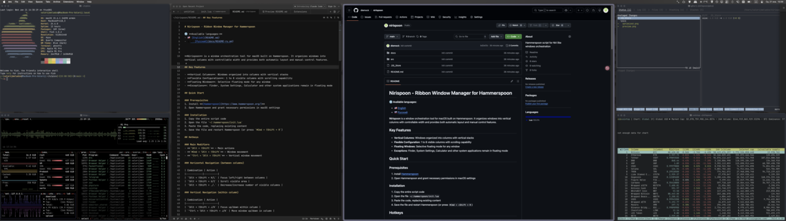
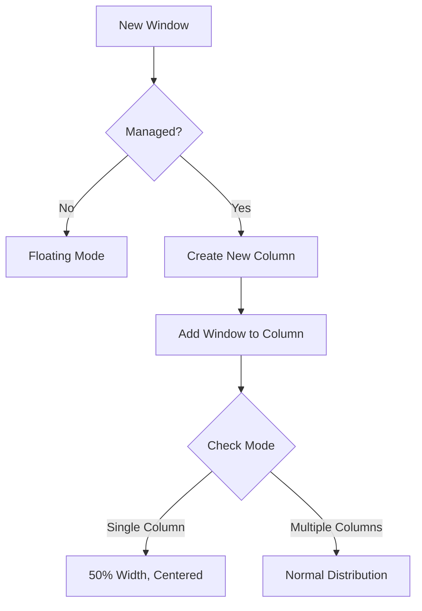

# Nirispoon - Ribbon Window Manager for Hammerspoon

🌐 **Available languages:**
- 🇺🇸 [English](README.md)
- 🇷🇺 [Русский](docs/README-ru.md)

<p align="center">
  
</p>

**Nirispoon** is a window orchestration tool for macOS built on Hammerspoon. It organizes windows into vertical columns with controllable width and provides both automatic layout and manual control features.

## Key Features

- **Vertical Columns**: Windows organized into columns with vertical stacks
- **Flexible Configuration**: 1 to 8 visible columns with scrolling capability
- **Floating Windows**: Selective floating mode for any window
- **Exceptions**: Finder, System Settings, Calculator and other system applications remain in floating mode

## Quick Start

### Prerequisites
1. Install **[Hammerspoon](https://www.hammerspoon.org/)**
2. Open Hammerspoon and grant necessary permissions in macOS settings

### Installation
1. Copy the entire script code from `src/init.lua`
2. Open the file `~/.hammerspoon/init.lua`
3. Paste the code, replacing existing content
4. Save the file and restart Hammerspoon (or press `⌘Cmd + ⇧Shift + R`)

## Hotkeys

### Main Modifiers
- **`⌥Alt + ⇧Shift`** — Main actions
- **`⌘Cmd + ⌥Alt + ⇧Shift`** — Window movement
- **`⌃Ctrl + ⌥Alt + ⇧Shift`** — Vertical window movement

### Horizontal Navigation (between columns)

| Combination | Action |
|------------|----------|
| `⌥Alt + ⇧Shift + H/L` | Focus left/right between columns |
| `⌥Alt + ⇧Shift + U/I` | Scroll visible area |
| `⌥Alt + ⇧Shift + ,/.` | Decrease/increase number of visible columns |

### Vertical Navigation (within column)

| Combination | Action |
|------------|----------|
| `⌥Alt + ⇧Shift + J/K` | Focus up/down within column |
| `⌃Ctrl + ⌥Alt + ⇧Shift + J/K` | Move window up/down in column |

### Window Management

| Combination | Action |
|------------|----------|
| `⌘Cmd + ⌥Alt + ⇧Shift + H/L` | Move active window left/right (new column) |
| `⌥Alt + ⇧Shift + M/N` | Merge window with column left/right |
| `⌥Alt + ⇧Shift + F` | Enable/disable floating mode |
| `⌥Alt + ⇧Shift + R` | Collect all windows on all screens |

### Width Adjustment

| Combination | Action |
|------------|----------|
| `⌥Alt + ⇧Shift + W/S` | Increase/decrease width of active column |

### Help and Debugging

| Combination | Action |
|------------|----------|
| `⌥Alt + ⇧Shift + /` | Show hotkey help |
| `⌃Ctrl + ⌥Alt + ⇧Shift + R` | Force ribbon reload |

## Configuration

### Main Settings (can be modified in code)

```lua
-- Number of columns
minColumns = 1          -- Minimum number of columns
maxColumns = 8          -- Maximum number of columns
defaultColumns = 3      -- Default number of columns

-- Sizes
singleColumnWidth = 0.5 -- Width of single column (50% of screen)
focusedWeight = 1.6     -- Active column width coefficient
weightStep = 0.2        -- Width adjustment step
minFocusedWeight = 1.0  -- Minimum active column width

-- Gaps
verticalGap = 10        -- Gap between windows in column (px)
horizontalGap = 10      -- Gap between columns (px)

-- Behavior
newWindowDelay = 0.12   -- Delay for adding new window (sec)
offscreenX = 15000      -- Offset for hidden windows
```
### Window Distribution in Column
```lua
verticalSplitRatios = {
    [1] = { 1.0 },                -- one window: 100%
    [2] = { 0.5, 0.5 },           -- two windows: 50%/50%
    [3] = { 0.4, 0.3, 0.3 },      -- three windows: 40%/30%/30%
    [4] = { 0.35, 0.25, 0.2, 0.2 }, -- four windows
}
```

## Troubleshooting

### Common Issues

#### 1. Hotkeys not working
- Check Hammerspoon permissions in macOS settings
- Ensure no conflicts with other applications (Karabiner-Elements, BetterTouchTool, etc.)
- Restart Hammerspoon

#### 2. Windows not managed
- Check if the application is in the exception list
- Try adding window manually via `⌥Alt + ⇧Shift + F` (floating mode toggle)

#### 3. Incorrect window placement
- Press `⌥Alt + ⇧Shift + R` to collect all windows
- Or `⌃Ctrl + ⌥Alt + ⇧Shift + R` for forced ribbon reload
- Check `visibleColumns` value (should be 1 for 50% width mode)

### Debugging
- Open Hammerspoon console to view logs (`⌘Cmd + ⇧Shift + H`)
- Use `⌥Alt + ⇧Shift + /` to display help at any time
- For complete reset, restart Hammerspoon

## Architecture

### Main Components

#### 1. **Column** — Vertical window stack
- Window management within column
- Focus navigation
- Vertical window movement

#### 2. **Ribbon** — Main screen manager
- Column management
- Window layout
- Hotkey processing

#### 3. **RibbonManager** — Multi-monitor manager
- Screen coordination
- Global operations

### Key Principles
- **One column per window** — each window always has its own column
- **`hasManualWidth` flag** — determines if system is in automatic or manual mode
- **Viewport** — virtual scrolling system for working with many columns

### System Workflow

## Updating

To update the script:
1. Replace contents of `~/.hammerspoon/init.lua`
2. Press `⌘Cmd + ⇧Shift + R` to reload
3. Or restart Hammerspoon completely

## Usage Tips

### Workflow
1. **Get Started**: Press `⌥Alt + ⇧Shift + R` to collect all windows
2. **Navigation**: Use `H/J/K/L` to move between windows
3. **Organization**: Move windows between columns using `⌘Cmd + ⌥Alt + ⇧Shift + H/L`
4. **Focus**: For single window work, use `⌥Alt + ⇧Shift + ,` (single column mode)
5. **Recovery**: Always return to initial state with `⌥Alt + ⇧Shift + R`

### Useful Combinations
- **Presentation Mode**: `⌥Alt + ⇧Shift + ,` (single column) → `⌥Alt + ⇧Shift + W` (increase width)
- **Quick Comparison**: Two columns, active wider (`⌥Alt + ⇧Shift + W`)
- **Multitasking**: 3-4 columns with scrolling (`⌥Alt + ⇧Shift + U/I`)

---

## Recommended Add-ons

For better experience combine Nirispoon with:

| Application | Purpose | Link |
|------------|------------|--------|
| **HazeOver** | Dim inactive windows | [hazeover.com](https://hazeover.com/) |
| **AltTab** | Enhanced window switcher | [alt-tab-macos.netlify.app](https://alt-tab-macos.netlify.app/) |
| **Rectangle** | Additional window management features | [rectangleapp.com](https://rectangleapp.com/) |
| **BetterTouchTool** | Advanced gestures and hotkeys | [folivora.ai](https://folivora.ai/) |

## Useful Links

- [Hammerspoon Official Website](https://www.hammerspoon.org/)
- [Hammerspoon Documentation](https://www.hammerspoon.org/docs/)
- [Hammerspoon Sample Configurations](https://github.com/Hammerspoon/hammerspoon/wiki/Sample-Configurations)
- [Hammerspoon Community](https://github.com/Hammerspoon/hammerspoon)
