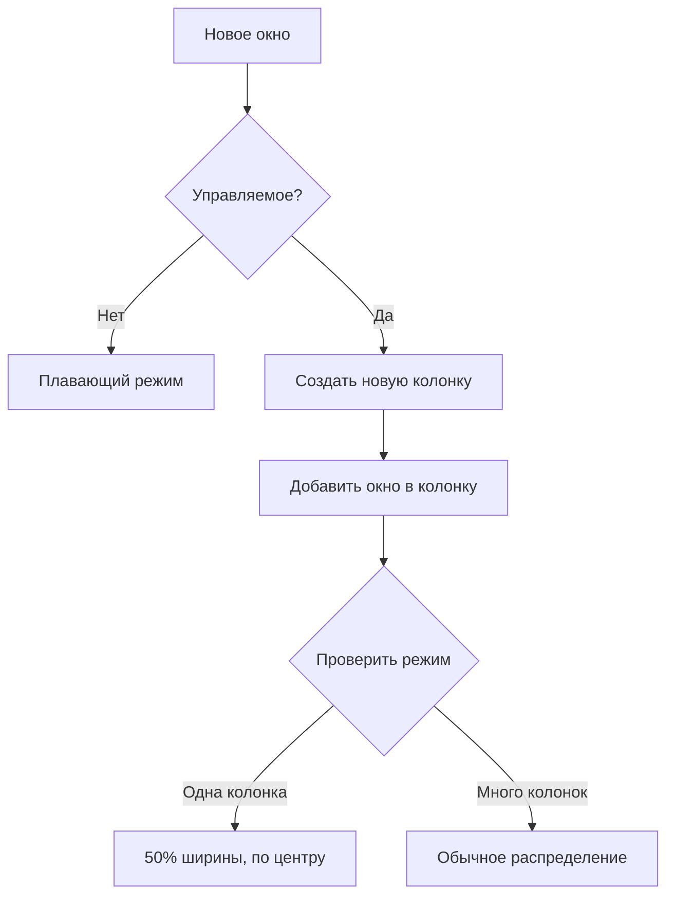

# Nirispoon - Ribbon Window Manager for Hammerspoon

**Nirispoon** — это инструмент оркестрации окон для macOS, построенный на Hammerspoon. Он позволяет организовать окна в вертикальные колонки с управляемой шириной и предоставляет как автоматическую компоновку, так и функции ручного контроля.

## Основные особенности

- **Вертикальные колонки**: Окна организованы в колонки с вертикальными стеками
- **Гибкая настройка**: От 1 до 8 видимых колонок с возможностью прокрутки
- **Плавающие окна**: Выборочный плавающий режим для любых окон
- **Исключения** — Finder, System Settings, Calculator и другие системные приложения остаются в плавающем режиме

## Быстрый старт

### Предварительные требования
1. Установите **[Hammerspoon](https://www.hammerspoon.org/)**
2. Откройте Hammerspoon и разрешите доступ в настройках macOS

### Установка
1. Скопируйте весь код скрипта
2. Откройте файл `~/.hammerspoon/init.lua`
3. Вставьте код, заменив существующее содержимое
4. Сохраните файл и перезапустите Hammerspoon (или нажмите `⌘Cmd + ⇧Shift + R`)

## Горячие клавиши

### Основные модификаторы
- **`⌥Alt + ⇧Shift`** — Основные действия
- **`⌘Cmd + ⌥Alt + ⇧Shift`** — Перемещение окон
- **`⌃Ctrl + ⌥Alt + ⇧Shift`** — Вертикальное перемещение окон

### Горизонтальная навигация (между колонками)

| Комбинация | Действие |
|------------|----------|
| `⌥Alt + ⇧Shift + H/L` | Фокус влево/вправо между колонками |
| `⌥Alt + ⇧Shift + U/I` | Прокрутка видимой области |
| `⌥Alt + ⇧Shift + ,/.` | Уменьшить/увеличить количество видимых колонок |

### Вертикальная навигация (внутри колонки)

| Комбинация | Действие |
|------------|----------|
| `⌥Alt + ⇧Shift + J/K` | Фокус вверх/вниз внутри колонки |
| `⌃Ctrl + ⌥Alt + ⇧Shift + J/K` | Переместить окно вверх/вниз в колонке |

### Управление окнами

| Комбинация | Действие |
|------------|----------|
| `⌘Cmd + ⌥Alt + ⇧Shift + H/L` | Переместить активное окно влево/вправо (новая колонка) |
| `⌥Alt + ⇧Shift + M/N` | Объединить окно с колонкой слева/справа |
| `⌥Alt + ⇧Shift + F` | Включить/выключить плавающий режим |
| `⌥Alt + ⇧Shift + R` | Собрать все окна на всех экранах |

### Настройка ширины

| Комбинация | Действие |
|------------|----------|
| `⌥Alt + ⇧Shift + W/S` | Увеличить/уменьшить ширину активной колонки |

### Справка и отладка

| Комбинация                  | Действие                             |
| --------------------------- | ------------------------------------ |
| `⌥Alt + ⇧Shift + /`         | Показать справку по горячим клавишам |
| `⌃Ctrl + ⌥Alt + ⇧Shift + R` | Принудительный релоад ленты          |


## Конфигурация

### Основные настройки (можно менять в коде)

```lua
-- Количество колонок
minColumns = 1          -- Минимальное количество колонок
maxColumns = 8          -- Максимальное количество колонок
defaultColumns = 3      -- Колонок по умолчанию

-- Размеры
singleColumnWidth = 0.5 -- Ширина одной колонки (50% экрана)
focusedWeight = 1.6     -- Коэффициент ширины активной колонки
weightStep = 0.2        -- Шаг изменения ширины
minFocusedWeight = 1.0  -- Минимальная ширина активной колонки

-- Отступы
verticalGap = 10        -- Зазор между окнами в колонке (px)
horizontalGap = 10      -- Зазор между колонками (px)

-- Поведение
newWindowDelay = 0.12   -- Задержка добавления нового окна (сек)
offscreenX = 15000      -- Сдвиг для скрытых окон
```

### Распределение окон в колонке

```lua
verticalSplitRatios = {
    [1] = { 1.0 },                -- одно окно: 100%
    [2] = { 0.5, 0.5 },           -- два окна: 50%/50%
    [3] = { 0.4, 0.3, 0.3 },      -- три окна: 40%/30%/30%
    [4] = { 0.35, 0.25, 0.2, 0.2 }, -- четыре окна
}
```
## Решение проблем

### Общие проблемы

#### 1. Горячие клавиши не работают
- Проверьте разрешения Hammerspoon в настройках macOS
- Убедитесь, что нет конфликтов с другими приложениями (Karabiner-Elements, BetterTouchTool и т.д.)
- Перезапустите Hammerspoon

#### 2. Окна не управляются
- Проверьте, что приложение не в списке исключений
- Попробуйте добавить окно вручную через `⌥Alt + ⇧Shift + F` (плавающий режим)

#### 3. Неправильное расположение окон
- Нажмите `⌥Alt + ⇧Shift + R` для сбора всех окон
- Или `⌃Ctrl + ⌥Alt + ⇧Shift + R` для принудительного релоада ленты
- Проверьте значение `visibleColumns` (должно быть 1 для режима 50%)

### Отладка
- Откройте консоль Hammerspoon для просмотра логов (`⌘Cmd + ⇧Shift + H`)
- Используйте `⌥Alt + ⇧Shift + /` для отображения справки в любое время
- Для полного сброса перезапустите Hammerspoon

## Архитектура

### Основные компоненты

#### 1. **Column** — Вертикальный стек окон
- Управление окнами внутри колонки
- Навигация по фокусу
- Вертикальное перемещение окон

#### 2. **Ribbon** — Основной менеджер для экрана
- Управление колонками
- Компоновка окон
- Обработка горячих клавиш

#### 3. **RibbonManager** — Мультимониторный менеджер
- Координация между экранами
- Глобальные операции

### Ключевые принципы
- **Одна колонка на окно** — каждое окно всегда имеет свою собственную колонку
- **Флаг `hasManualWidth`** — определяет, находится ли система в автоматическом или ручном режиме
- **Viewport** — система виртуальной прокрутки для работы с большим количеством колонок

### Рабочий процесс системы



## Обновление

Для обновления скрипта:
1. Замените содержимое `~/.hammerspoon/init.lua`
2. Нажмите `⌘Cmd + ⇧Shift + R` для перезагрузки
3. Или перезапустите Hammerspoon полностью

## Советы по использованию

### Рабочий процесс
1. **Начало работы**: Нажмите `⌥Alt + ⇧Shift + R` для сбора всех окон
2. **Навигация**: Используйте `H/J/K/L` для перемещения между окнами
3. **Организация**: Перемещайте окна между колонками с помощью `⌘Cmd + ⌥Alt + ⇧Shift + H/L`
4. **Фокус**: Для работы с одним окном используйте `⌥Alt + ⇧Shift + ,` (режим одной колонки)
5. **Восстановление**: Всегда можно вернуться к начальному состоянию с помощью `⌥Alt + ⇧Shift + R`


### Полезные комбинации
- **Презентационный режим**: `⌥Alt + ⇧Shift + ,` (одна колонка) → `⌥Alt + ⇧Shift + W` (увеличить ширину)
- **Быстрое сравнение**: Две колонки, активная шире (`⌥Alt + ⇧Shift + W`)
- **Мультизадачность**: 3-4 колонки с прокруткой (`⌥Alt + ⇧Shift + U/I`)

---

## Рекомендуемые дополнения

Для лучшего опыта использования комбинируйте Nirispoon с:

| Приложение | Назначение | Ссылка |
|------------|------------|--------|
| **HazeOver** | Затемнение неактивных окон | [hazeover.com](https://hazeover.com/) |
| **AltTab** | Улучшенный переключатель окон | [alt-tab-macos.netlify.app](https://alt-tab-macos.netlify.app/) |
| **Rectangle** | Дополнительные функции управления окнами | [rectangleapp.com](https://rectangleapp.com/) |
| **BetterTouchTool** | Расширенные жесты и хоткеи | [folivora.ai](https://folivora.ai/) |

## Полезные ссылки

- [Официальный сайт Hammerspoon](https://www.hammerspoon.org/)
- [Документация Hammerspoon](https://www.hammerspoon.org/docs/)
- [Примеры скриптов Hammerspoon](https://github.com/Hammerspoon/hammerspoon/wiki/Sample-Configurations)
- [Сообщество Hammerspoon](https://github.com/Hammerspoon/hammerspoon)
